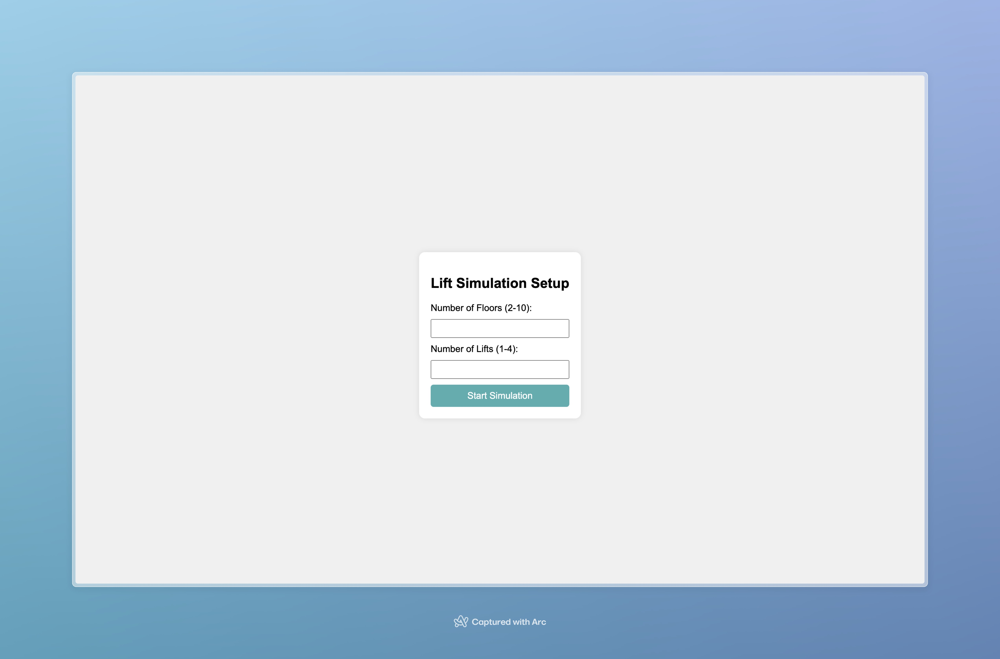
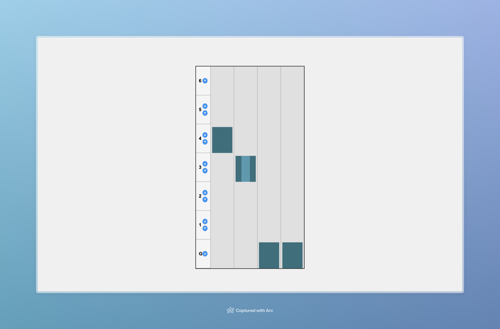

# Building Lift Simulator

This is a simple building lift simulator that allows you to see how a building lift system works.

## How to use

1. Open the `index.html` file in your browser.
2. Enter the number of floors and lifts you want to simulate.
3. Click the "Simulate" button to start the simulation.
4. Use the buttons to call lifts to different floors.

## Screenshots

### Setup Form

### Simulation

## Code Explanation

### Elevator Simulation Flow

1. Initial Setup:

   - The code selects HTML elements and initializes a state object with floors, lifts, and lift calls.

2. Simulation Creation:

   - When the simulation form is submitted, it hides the setup form and calls `createSimulation()`.
   - `createSimulation()` generates visual elements for floors and lifts based on user input.
   - It sets up click event listeners for floor buttons.

3. Calling a Lift:

   - When a floor button is clicked, `callLift()` is triggered.
   - It adds the call to `state.liftCalls` if not already present.
   - Then it calls `processLiftCalls()`.

4. Processing Lift Calls:

   - `processLiftCalls()` checks for pending calls.
   - It finds the nearest available lift using `findNearestAvailableLift()`.
   - If an available lift is found, it calls `moveLift()` with the lift index and target floor.

5. Moving the Lift:

   - `moveLift()` sets the lift as moving and adds the target floor to its queue.
   - It calls `moveToNextFloor()`, which handles movement to each floor in the queue.

6. Lift Movement Animation:

   - `animateLiftMovement()` uses `requestAnimationFrame` to smoothly animate the lift's position.
   - Once complete, it calls the provided callback.

7. Door Operations:

   - After reaching a floor, `openDoors()` is called to animate doors opening.
   - After a delay, `closeDoors()` is called to animate doors closing.

8. Continuing the Process:
   - After completing a move, the lift checks for more floors in its queue.
   - If there are more, it continues to the next floor.
   - If not, it sets itself as not moving and calls `processLiftCalls()` again to check for new calls.

This cycle continues, with lifts responding to calls, moving to floors, opening and closing doors, and then checking for new calls.

### Setup

The setup form has two input fields: number of floors and number of lifts. The form is submitted when the user clicks the "Simulate" button.

### Floor and Lift Generation

The `createSimulation` function sets up the visual elements and initial state for the elevator simulation. It creates floor elements, lift shafts, and lifts, initializes the state for each lift, and adds event listeners to floor buttons.

### Lift Operations

- `callLift`: Initiates a lift call, adding it to the queue if not already present.
- `processLiftCalls`: Processes pending lift calls, finding the nearest available lift.
- `findNearestAvailableLift`: Locates the closest available lift to respond to a call.
- `moveLift`: Manages the movement of a lift to a specific floor.
- `moveToNextFloor`: Handles the lift's movement to each floor in its queue.
- `animateLiftMovement`: Animates the lift's movement using `requestAnimationFrame`.
- `openDoors` and `closeDoors`: Manage the animation of lift doors opening and closing.
